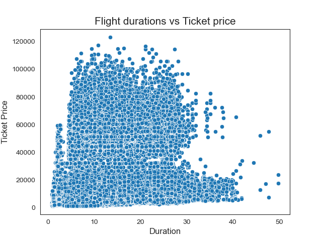

> #  Analysis of the flight ticket price

> ### Introduction
* The objective of the study is to analyze the flight booking dataset obtained from **Ease My Trip** website. **Easemytrip** is an internet platform for booking flight tickets, and hence a platform that potential passengers use to buy tickets. A thorough study of the data will aid in the discovery of valuable insights that will be of enormous value to passengers.
> ### Source of dataset
 * We collected the dataset from [kaggle.com](https://www.kaggle.com/datasets/shubhambathwal/flight-price-prediction)
 
 > ### Size of dataset
 * Size of airline_dataset is 24.68 MB

 > ### About the dataset
* Dataset contains information about flight booking from the website Easemytrip for flight travel between India's top 6 metro cities. 
* Dataset contains 11 columns namely - 'Unnamed: 0', 'airline', 'flight', 'source_city', 'departure_time', 'stops', 'arrival_time','destination_city', 'class', 'duration', 'days_left', 'price'.

> ### Liberaries
* Numpy
* Pandas
* Matplotlib
* Seaborn

> ### EDA Section
 
* Does price vary with Airlines?

Vistara airline average ticket price is very high(around 30000 rs) and AirAsia average ticket price is much less(around 5000 rs)compare to other airlines.

* How does stops column affect ticket price?
  

The flights that take one stop between the source and destination cities have ticket prices higher, over 20,000 rupees. The flights that have zero stops between the source and destination cities have the lowest ticket prices, around 10,000 rupees

* Do flight durations play a significant role in ticket pricing?

 
 Here flight duration do not play a significant role in ticket pricing and we can't see any significant relationship between price and duration.

 * Can we identify any specific combinations of factors (e.g., airline, class, stops) that consistently lead to higher or lower ticket prices? 
  

 Business class flights with two or more stops from Vistara Airlines have the highest ticket prices. Conversely, economy class flights with zero stops from GO_FIRST airline have the lowest ticket prices.

 

 
